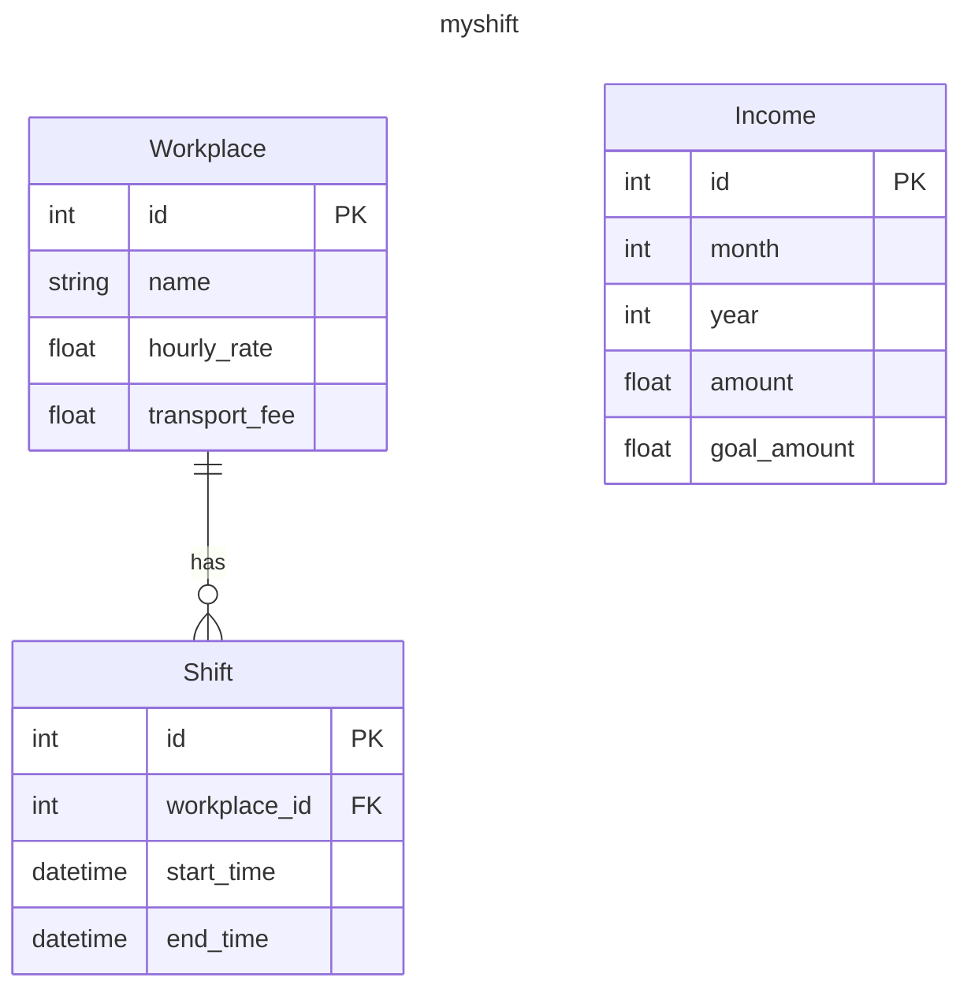

```mermaid
---
title: myshift
---
erDiagram
  Workplace ||--o{ Shift : has
  Workplace{
    int id PK
    string name
    float hourly_rate
    float transport_fee
  }
  Shift {
    int id PK
    int workplace_id FK
    datetime start_time
    datetime end_time
  }
  Income {
    int id PK
    int month
    int year
    float amount
    float goal_amount
  }
```